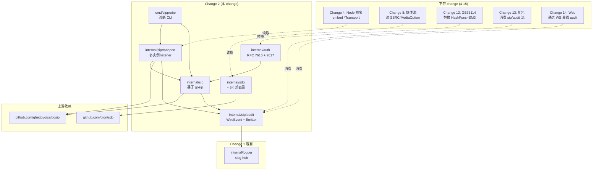

## 产品概述

Change 2 (`core-sip-stack`) 是 15 步路线图的第二步，交付**节点无关的 GB/T 28181-2016 SIP/SDP/Digest 底层库 + 进程内多实例 transport listener**，供后续 14 个 change（Node 抽象、身份、媒体、级联、2022 扩展、GB35114、异常流、Web、场景引擎）共享使用。本 change 不实现任何节点身份、UAC/UAS 业务行为、媒体层、级联或安全扩展，仅交付"启动、收发、认证、SDP 编解码、字节级审计"这五项原语。

## 核心特性

1. **SIP 消息构建/解析**（基于 `ghettovoice/gosip`）—— GB/T 28181 §L.1 强制头（Via branch、Max-Forwards、Content-Length、User-Agent）自动填充；不丢任何 RFC 3261 头；与现有21 项 logger 测试兼容
2. **SDP 解析/序列化**（基于 `pion/sdp` + 外层 §K 兼容层）—— `y=`（SSRC）与 `f=`（v/A/V/M MediaOption）字段不丢失；RFC 4566 字段完整保留；字节级 round-trip
3. **Digest 认证**（自研 RFC 7616 §3.4 + RFC 2617 §3 兼容）—— qop=auth 模式 + 不带 qop 旧客户端回退；username/realm 字段 UTF-8 规范化防御性处理；`HashFunc` 字段为 Change 12 预留 SM3 替换 hook
4. **多实例 transport listener** ——同一进程内多个 `*siptransport.Transport` 实例共存；UDP/TCP/TLS 三协议；进程退出时端口立即释放（无 TIME_WAIT 阻塞）；默认 64 容量接收 channel
5. **审计日志契约**（`internal/sip/audit`）—— 每条 rx/tx 报文转写为 trace 日志；4 KiB 截断；`Authorization` 头中 `response` 字段脱敏为 `***REDACTED***`
6. **诊断 CLI `sipprobe`** —— `--bind` / `--send-to` / `--expect-status` / `--timeout` 四个 flag；5 秒超时；退出码 0（命中）/ 2（超时）
7. **6 份按包测试报告**（`reports/change2-{sdp,auth,sip,siptransport,sipprobe,e2e}.md` + `change2-summary.md` 索引页）—— 每份报告含命令块原文 + 表格汇总 + "实施过程中的设计与缺陷记录"小节，覆盖所有踩坑点（pion `y=` 丢字段、SIP 头序列、gosip API 适配、RFC 7616/2617 兼容补充等）

## 技术栈

- **语言/工具链**：Go 1.25.0（与 Change 1 一致）；`CGO_ENABLED=0` 五平台编译
- **核心依赖**：
- `github.com/ghettovoice/gosip`（emiago 维护、纯 Go、CGO 自由；路线图钦定）—— SIP 消息模型、builder、parser、transport layer
- `github.com/pion/sdp`（RFC 4566、纯 Go）—— SDP 编解码；本 change 在其上叠加 §K 兼容层
- **已存在依赖（沿用 Change 1）**：`github.com/labstack/echo/v4`、`github.com/gorilla/websocket`、`github.com/spf13/viper`、`modernc.org/sqlite`
- **测试工具链**：stdlib `testing`（不引 testify）、`net.PacketConn` 本地 loopback、`tcpdump`（端到端 pcap 比对）、`sha256sum`（golden fixture）
- **构建系统**：Makefile（沿用 Change 1 框架，新增 `sip-test` 子集测试目标 + `release-matrix` 增列 sipprobe）

## 实施方法

### A. 模块边界

```
internal/sdp/         # Parse(text) -> *gb.Session, Marshal(*gb.Session) -> string
  ├─ sdp.go            # 公开 API + gb.Session/MediaBlock 类型
  ├─ kcompat.go        # §K 兼容层（行级 y=/f= 剥离 + 回填）
  └─ sdp_test.go       # 字节级 golden 测试

internal/auth/        # Digest Challenge/Verify
  ├─ challenger.go     # WWW-Authenticate 生成（RFC 7616 + 2617）
  ├─ responder.go      # Authorization 校验（含 UTF-8 规范化）
  ├─ hash.go           # 可插拔 HashFunc（默认 MD5）
  └─ *_test.go         # golden fixture + 边界测试

internal/sip/         # SIP 报文构建/解析
  ├─ builder.go        # BuildRequest/BuildResponse + 头自动填充
  ├─ parser.go         # ParseMessage + X-GB-Ver 透传
  ├─ branch.go         # crypto/rand 12 字节 base32 BranchGenerator
  ├─ auth.go           # ParseAuthorization 头解析辅助
  └─ *_test.go         # 真实抓包样本 round-trip

internal/sip/audit/   # WireEvent + Emitter 接口
  ├─ emitter.go        # slogEmitter（接 internal/logger，password/response 脱敏）
  ├─ redact.go         # Authorization 头字段脱敏规则
  └─ audit_test.go     # 4 KiB 截断 + 注入 emitter 验证

internal/siptransport/ # 多实例 transport listener
  ├─ transport.go      # New/Send/Receive/Close + 多协议
  ├─ options.go        # functional opts（bind scheme解析）
  └─ transport_test.go # 多实例、audit 钩子、channel 满 warn

cmd/sipprobe/          # 诊断 CLI
  └─ main.go           # flag 解析 + 双模式（接收 / 收发）
```

### B. SDP §K 兼容层实现要点（关键技术决策）

| 步骤 | 算法 | 复杂度 |
| --- | --- | --- |
| 解析预处理 | `bufio.Scanner` 按行扫描，`strings.HasPrefix(s, "y=")` / `HasPrefix(s, "f=")` 抽出为 `[]KLine{LineNo int; SSRC string; MediaOption string}`；剩余行 join 后传给 pion `Session.Unmarshal` | O(n) 行数 |
| 回填 | 按原 LineNo 把 KLine 插入到 `gb.Media` 中；构造 `gb.Session{Origin, SessionName, ConnectionInformation, TimeDescriptions, Attributes, SSRC, Media[]}` | O(n) |
| 序列化 | pion `Session.Marshal()` 渲染 RFC 4566 部分；再在每个 `m=` 块后按 §K.2 行序（先 `y=` 再 `f=`）插入；未设 SSRC 时**不**输出空 `y=` 行 | O(n) |
| 恶意 SDP 兼容 | 缺 `y=`/`f=`、空 `f=`、CRLF/LF 混用、`a=y:12345`（伪属性）—— 期望均解析成功或返回明确错误 | 5 个子用例 |


**性能基线**（任务 §2.5）：`BenchmarkParse` < 50 µs / 1 KiB SDP（行级扫描 + pion 单次解析）。

### C. Auth 双模式 + UTF-8 规范化（关键技术决策）

```
Challenger.Challenge(realm, opts) -> (wwwAuthenticate, nonce, err)
  ├─ 强制: realm, nonce=base64(rand16), qop=auth, algorithm=MD5
  └─ 可选: opaque=base64(rand8)

Responder.Verify(req, password) -> error
  ├─ ParseAuthorization(value) -> 8 字段
  ├─ 检测 qop 字段：
  │   ├─ 存在 -> RFC 7616 §3.4 公式:
  │   │     HA1 = MD5(user:realm:password)
  │   │     HA2 = MD5(method:uri)
  │   │     response = MD5(HA1:nonce:nc:cnonce:qop:HA2)
  │   └─ 缺失 -> RFC 2617 §3 公式:
  │         response = MD5(MD5(user:realm:password):nonce:MD5(method:uri))
  ├─ UTF-8 规范化（新增）：username/realm 若含非 ASCII 字节按 utf8.ValidString 校验；
  │   合法时直接进 MD5，非法时返回 ErrInvalidResponse
  └─ 字节比较：与请求中 response 字段 hex(大写) 常量时间比对
```

**RFC 7616 vs 2617 公式差异点**：qop=auth 路径在 HA1 与 HA2 之间多出 `:nc:cnonce:qop` 五个字段；RFC 2617 路径直接拼接 HA1 与 nonce。

**HashFunc 可插拔**（任务 §3.3）：默认 `MD5`；Change 12 替换 `SM3` 时仅替换 `HashFunc` 字段，挑战/响应接口签名零变化。

### D. Transport 多实例与审计钩子

`siptransport.New(bind, opts...)`：

1. 解析 `bind` scheme（`udp://` / `tcp://` / `tls://`），获取 `host:port`
2. 调 `gosip/transport.Layer.ListenUDP/TCP("protocol", addr)` 创建独立 socket
3.内部启 1 个 reader goroutine →64 容量 channel
3. `Send(req, dst)`：serialize → `Layer.Send([]byteString, dst)` → emit `tx` WireEvent
4. `Receive(ctx)`：从 channel 取 → emit `rx` WireEvent
5. `Close()`：cancel reader goroutine + 关 socket（保证 SO_REUSEADDR 立即释放）

**审计钩子接入点**：每个 Send/Receive 完成后调 `audit.Global().Emit(WireEvent{...})`；测试通过 `audit.SetEmitter(custom)` 替换验证5 包 10 事件。

### E. 与 Change 1 的非侵入对接

- `internal/logger` 接口零变化：`audit` 包内 `slogEmitter` 直接持 `*slog.Logger` 引用（从 `internal/logger.New` 获取 hub），trace 级记录- 脱敏规则：扫描 `bytes` 中的 `Authorization` 头正则替换 `response="[^"]+"` → `response="***REDACTED***"`
- `internal/config` 不动；`internal/api` 不动；`internal/storage` 不动

## 实施注意事项（执行细节）

- **依赖锁版**：CI 锁 `ghettovoice/gosip` 与 `pion/sdp` 到具体 commit（防 R1/R2）
- **pion API 探针**：任务 §2.5 与 §2.6 实际跑通前不写大段代码——先 `go doc pion/sdp` 与 `go doc ghettovoice/gosip/transport` 验证 API 形状
- **Channel 满 warn 不记 error**（设计 R5）——避免误导上游
- **Windows 同端口多实例禁止**（设计 R4）——文档化 + 探测时报错
- **Golden fixture 字节稳定性**（设计 R6）——手工构造，不依赖运行时序列化
- **审计脱敏**：regex 用非贪婪 `response="([^"]+)"` 替换，避免匹配跨字段## 架构设计



## 目录结构

```
项目根/
├── go.mod                                          # [MODIFY] 加入 gosip + pion/sdp
├── go.sum                                          # [MODIFY] tidy 产物
├── Makefile                                        # [MODIFY] 新增 sip-test 目标 + release-matrix 增列 sipprobe
├── README.md                                       # [MODIFY] 技术栈速览 + 开发指南补两条命令
├── cmd/
│   ├── gb28181-simulator/                          # 不动
│   └── sipprobe/                                   # [NEW] 诊断 CLI
│       └── main.go
├── internal/
│   ├── logger/                                     # 不动（Change 1）
│   ├── config/                                     # 不动
│   ├── storage/                                    # 不动
│   ├── api/                                        # 不动
│   ├── webui/                                      # 不动
│   ├── sdp/                                        # [NEW] SDP 解析/序列化
│   │   ├── sdp.go                                  # 公开 API + gb.Session/MediaBlock
│   │   ├── kcompat.go                              # §K 行级 y=/f= 兼容层
│   │   ├── sdp_test.go                             # 字节级 golden 测试
│   │   └── testdata/                               # ≥3 份 .sdp + .sha256
│   ├── auth/                                       # [NEW] Digest认证
│   │   ├── challenger.go
│   │   ├── responder.go                            # 含 UTF-8 规范化
│   │   ├── hash.go
│   │   ├── *_test.go
│   │   └── testdata/                               # ≥3 份 .auth + .sha256
│   ├── sip/                                        # [NEW] SIP 报文
│   │   ├── builder.go                             # BuildRequest/BuildResponse
│   │   ├── parser.go                               # ParseMessage
│   │   ├── branch.go                               # crypto/rand branch
│   │   ├── auth.go                                 # ParseAuthorization
│   │   ├── audit/                                  # 嵌套子包
│   │   │   ├── emitter.go
│   │   │   ├── redact.go
│   │   │   └── audit_test.go
│   │   ├── *_test.go
│   │   └── testdata/                               # ≥3 份 .sip + .sha256
│   └── siptransport/                               # [NEW] 多实例 listener
│       ├── transport.go
│       ├── options.go
│       └── transport_test.go
├── scripts/
│   └── smoke-sip.sh                                # [NEW] 双进程 INVITE/200 互发
├── openspec/
│   ├── changes/
│   │   └── core-sip-stack/                         # [EXISTING-DRAFT]
│   │       ├── proposal.md                         # 已有
│   │       ├── design.md                           # 已有
│   │       ├── tasks.md                            # [MODIFY] §3 加 3.5 UTF-8 任务；§10 Evidence 列出6 份报告清单
│   │       └── specs/core-sip-stack/spec.md        # [MODIFY] Digest Requirement 末尾追加 UTF-8 Scenario
│   └── specs/core-sip-stack/spec.md                # [NEW-AT-ARCHIVE] 主 spec 同步
├── reports/                                        # [NEW] 6 份分包报告 + 索引
│   ├── change2-summary.md                          # 6 份报告索引 + 总览表
│   ├── change2-sdp.md
│   ├── change2-auth.md
│   ├── change2-sip.md
│   ├── change2-siptransport.md
│   ├── change2-sipprobe.md
│   └── change2-e2e.md
└── .github/workflows/ci.yml                        # 不动
```

## 关键代码契约（接口层稳定性 = 跨 Change 4-15 兼容的承诺）

```
// internal/sdp/sdp.go
type Session struct {
    *pion.SessionDescription        // 嵌入 RFC 4566 字段
    SSRC         string              // 顶层 SSRC（会话级）
    Media        []*MediaBlock        // 每个媒体块携带 §K 字段
}
type MediaBlock struct {
    *pion.MediaDescription // 嵌入 RFC 4566 媒体字段
    SSRC         string              // 媒体级 SSRC（GB/T 28181 §K）
    MediaOption  string              // "v"|"a"|"av"|"m"
}
func Parse(text string) (*Session, error)
func Marshal(s *Session) (string, error)

// internal/auth/auth.go
type Challenger interface {
    Challenge(realm string, opts ...ChallengeOption) (wwwAuthenticate string, nonce string, err error)
}
type Responder interface {
    Verify(req *sip.Request, password string) error  // 返回 nil=通过；ErrInvalidResponse=失败
}

// internal/siptransport/transport.go
type Transport struct{ /* unexported */ }
func New(bind string, opts ...Option) (*Transport, error)
func (t *Transport) Send(req sip.Request, dst string) error
func (t *Transport) Receive(ctx context.Context) (msg sip.Message, remote string, err error)
func (t *Transport) Close() error

// internal/sip/audit/audit.go
type WireEvent struct {
    Direction string // "r" | "t"
    Local, Remote string
    Bytes      []byte
    Timestamp  time.Time
}
type Emitter interface{ Emit(WireEvent) }
func Global() Emitter
func SetEmitter(e Emitter)
```

## Agent Extensions

本 change 实施过程中**仅使用现有 skills 中明确列出的工具**，未添加任何未提供的扩展。

### Skill

- **openspec-apply-change**
- 用途：按 tasks.md 顺序实施35 个子任务，每个子任务推进后由 `openspec status --change core-sip-stack` 校验
- 预期产出：每个子任务对应一份 stdout 证据、写入对应 `reports/change2-*.md` 报告

- **openspec-verify-change**
- 用途：实施完成后逐条核对 spec.md 的 ADDED Requirement 是否实现；用于归档前
- 预期产出：所有 Requirement 的 When/Then 场景均有对应测试覆盖

- **openspec-archive-change**
- 用途：所有任务完成 + 6 份报告就位 + spec 同步 + 验证通过后归档
- 预期产出：change 移到 `openspec/changes/archive/2026-09-23-core-sip-stack/`，生成中文归档报告

- **openspec-sync-specs**
- 用途：归档前把 delta spec 的 ADDED Requirements 同步到 `openspec/main-specs/core-sip-stack/spec.md`（ADDED-only 本 change）
- 预期产出：主 spec 含全部 8 个 Requirement + 新增的 UTF-8 Scenario