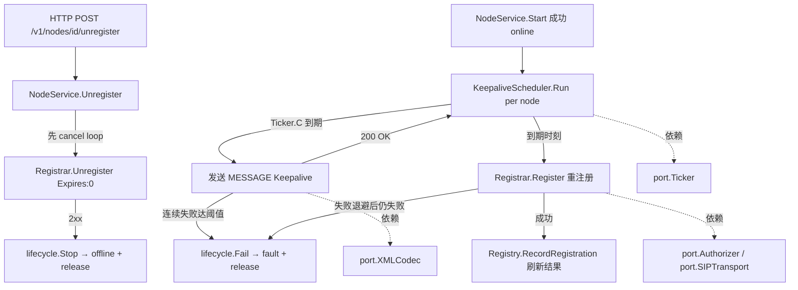

## 用户要求
- 先把已完成的 Change 5（device 注册全流程）的全部改动提交为一个 git commit：包含归档目录 `openspec/changes/archive/2026-09-24-device-node-registration/`、新建主 spec `openspec/specs/device-node/`、合入后的 `node-abstraction` / `core-sip-stack` 主 spec，以及全部实现代码。
- 随后交付路线图 #5 `device-node` 的剩余部分：**device 保活与注销**——MESSAGE 心跳保活（周期发送、超时/连续失败回落）、注册过期前重注册、unregister 优雅下线；复用已落地的 `Registrar` 与 `Lifecycle`。

## 产品概述
模拟器中的 device 节点（IPC/NVR）在完成注册进入 `online` 后，需要像真实国标设备一样持续维持在线状态：周期性向上級平台发送 MANSCDP Keepalive 心跳、在注册有效期届满前主动重注册、收到停止/注销指令时以 `Expires: 0` 的 REGISTER 优雅下线。心跳与重注册失败需要可观测、可回落，不留半在线节点。

## 核心特性
- **心跳保活**：online 节点按可配置周期（默认 60s）向平台发送 `MESSAGE`（MANSCDP `<Notify><CmdType>Keepalive</CmdType>`，含 SN、DeviceID、Status），等待 200 OK；连续失败达阈值（默认 3 次）→ 节点回落 `fault` 并释放端口。
- **过期前重注册**：依据平台授予的 `Expires` 推导下次重注册时刻（默认 `min(expiry/2, expiry-60s)`，取正值），到点复用 `Registrar.Register` 重新完成事务并刷新 `RegistrationResult`；失败走退避重试，达到上限同样回落 `fault`。
- **优雅注销**：`POST /v1/nodes/{id}/unregister` 发送 `Expires: 0` 的 REGISTER，收到 2xx 后节点进入 `offline`；注销前先停止心跳与重注册协程，再释放监听端口，避免向已关闭的 transport 发送报文。
- **可观测性**：心跳/重注册/注销事件均带 `node_id` 结构化日志；失败沿用既有 `StagedFailure` 机制，HTTP 错误体给出阶段（send / challenge / response / timeout / keepalive / reregister），敏感字段按既有规则脱敏。
- **配置声明**：节点注册段新增可选 `heartbeat`（interval / max_failures）与 `reregister`（enabled / margin）参数，缺省即取默认值；省略注册段时行为与此前完全一致。


## 技术栈
- 既有栈：Go 1.22 纯 Go 无 CGO；六边形架构 `internal/{domain,app,adapter,interface,platform}`；SIP 栈 `github.com/ghettovoice/gosip`；HTTP `labstack/echo/v4`；日志 `log/slog`；配置 `spf13/viper`；openspec（spec-driven）管理变更。
- 本 change 不新增第三方依赖：MANSCDP Keepalive 用标准库 `encoding/xml` 实现；定时器用标准库 `time` + 可注入端口。

## 实现思路
沿用「app 层编配 + adapter 实现细节 + domain 端口隔离」的既有范式：注册事务已由 `Registrar.Register` 完成，本次把「周期性」这一新职责拆成两个可测试的部件——**可注入 Ticker 端口**（app 不直接用 `time.Ticker`，测试用 fake 驱动，避免 sleep）与**协程化的保活调度器**（每个 online 节点一个 goroutine，随 stop/unregister/fault 终止）。MANSCDP 心跳体按既有 `port.SDPCodec` 的范式做成 `port.XMLCodec`（适配器在 `internal/adapter/xml`），app 层只依赖端口，不破坏「app 不得 import adapter」的架构断言。

### 关键决策与取舍
- **D1 新建 `port.Ticker` 而非直接用 `time.Ticker`**：心跳/重注册是时间驱动逻辑，真实 ticker 会让测试只能 sleep；端口化后测试可确定性推进。取舍：多一层接口，但收益是单元测试零 sleep、CI 稳定。
- **D2 Keepalive 编解码放 adapter，经端口注入**：`encoding/xml` 属协议细节，app 层不得 import adapter；与 `SDPCodec` / `Authorizer` 的既有范式一致。SN 自增由调度器持有（每节点独立计数）。
- **D3 每节点一个 goroutine，而非全局扫描循环**：与「节点互不串扰」的既有需求一致，停止语义清晰（cancel 该节点的 ctx 即可）。取舍：goroutine 数与节点数线性（目标场景数千节点可接受），需严谨的退出路径防泄漏。
- **D4 停止顺序固定为「停 loop → 再 release transport」**：`lifecycle.release` 会关闭 transport，若协程仍在运行会向已关闭传输发送；故 `Stop`/`Fail`/注销统一先 cancel 再 release。
- **D5 注销走 `Expires: 0` 的 REGISTER，状态只能 `online→offline`**：状态机只允许该迁移，不新增迁移；注销后如需再注册走 `offline→registering`。
- **D6 重注册时机由 `RegisteredAt + GrantedExpiry` 推导**，不改动 `RegistrationResult` 构造函数签名（避免波及 `device_registrar.go`、`nodereg/registry.go`、`model/node.go` 四处调用点）；过期时刻在调度器内计算。
- **D7 失败回落统一复用 `lifecycle.Fail`**：与注册失败一致，`fault` + 释放端口，HTTP 侧自动获得 502 + stage。

### 性能与可靠性
- 单节点稳态：每周期 1 次 MESSAGE + 1 次响应匹配，O(1)；接收过滤沿用「Call-ID + peer 双条件」，不匹配报文直接 continue（与注册事务同范式，避免误判）。
- 避免 N+1/重复遍历：调度器只持有本节点的 transport 与参数，不做全局节点扫描；`Registry.RecordRegistration` 仍是 O(1) 写入。
- 资源：goroutine 退出必须走 `defer cancel()` + `WaitGroup` 等待，调度器实现 `io.Closer` 并接入 `servicectx.Cancel`，进程退出时统一关闭；心跳超时用 `context.WithTimeout` 约束，不泄漏挂起的 `Receive`。

## 实施注意事项
- **架构断言**：`go list -deps ./internal/app/...` 必须仍只含 `internal/domain/...` 与 `internal/platform/...`（既有测试断言），新端口放 `internal/domain/port`。
- **测试基建扩展**：`internal/adapter/siptest/uas.go` 当前 `if msg.Method() != "REGISTER" { continue }`，需新增 MESSAGE → 200 OK 分支（否则心跳 e2e 无法成立）；app 层测试复用 `scriptedTransport`（空脚本即阻塞到 ctx done，正好用于测超时）与 `fakeClock`。
- **日志**：复用既有 slog handler，字段 `node_id`、`call_id`、`sn`、`stage`；不打印密码/`response`/`nonce`。
- **向后兼容**：节点未配置注册段时，不启动任何 goroutine，行为与 Change 5 之前完全一致；新增配置字段全部可选且带默认值，非法值在配置加载期报错。
- **爆炸半径**：不改 `RegistrationResult` 构造函数签名、不改状态机迁移表；HTTP 仅新增一个动作与 `NodeView` 一个方法，复用既有 `controlNode` 错误映射。

## 架构设计


## 目录结构
```
openspec/changes/device-node-keepalive/            # [NEW] openspec 变更工件
├── proposal.md                                    # [NEW] 动机、变更清单、Non-goals（不含目录上报/点播/平台侧）
├── design.md                                      # [NEW] D1–D7 决策、备选方案与取舍
├── tasks.md                                       # [NEW] 任务清单（≤2h 粒度，含 golden test）
└── specs/device-node/spec.md                      # [NEW] delta：ADDED 心跳/重注册/注销需求；MODIFIED 注册相关需求（保活开关）
internal/domain/port/
├── ticker.go                                      # [NEW] Ticker 端口：周期信号抽象，供 app 层注入与测试替身
└── codec.go                                       # [MODIFY] 追加 XMLCodec 端口（Keepalive 编解码），与既有 SDPCodec 同范式
internal/domain/model/
├── keepalive.go                                   # [NEW] Keepalive 值对象（SN/DeviceID/Status）与心跳配置（interval、max_failures、margin）校验
└── registration.go                                # [MODIFY] 新增心跳/重注册参数字段与访问器（可选、带默认值）
internal/adapter/xml/
└── keepalive_codec.go                             # [NEW] Keepalive XML 编解码适配器（encoding/xml），实现 port.XMLCodec
internal/platform/clock/
└── ticker.go                                      # [NEW] 真实 Ticker 实现与 fake（可手动触发、确定性推进）
internal/app/
├── device_keepalive.go                            # [NEW] 每节点保活调度器：心跳发送/响应匹配、失败计数、重注册时刻计算与退避、goroutine 生命周期
├── device_registrar.go                            # [MODIFY] 追加 Unregister（Expires: 0）事务；抽出 Call-ID/peer 响应匹配 helper 复用
└── node_service.go                                # [MODIFY] Start 成功后启动调度器；Stop/Fail/Unregister 先停 loop 再 release
internal/adapter/nodereg/lifecycle.go              # [MODIFY] 确保 release 前协程已停（提供停止钩子/幂等 release）
internal/adapter/siptest/uas.go                    # [MODIFY] 新增 MESSAGE → 200 OK 分支，使心跳 e2e 可成立
internal/interface/http/
├── nodes.go                                        # [MODIFY] NodeView 增加 Unregister；新增 handleNodeUnregister 复用 controlNode 错误映射
└── server.go                                       # [MODIFY] 注册 POST /v1/nodes/:id/unregister 路由
internal/platform/config/config.go                 # [MODIFY] 节点注册段新增可选 heartbeat / reregister 字段与校验
cmd/gb28181-simulator/main.go                      # [MODIFY] 装配 Ticker、XMLCodec、调度器；调度器注册进 servicectx.Cancel
configs/config.example.yaml                        # [MODIFY] 示例配置补充 heartbeat 段
internal/app/device_keepalive_test.go              # [NEW] 调度器单测（fake Ticker + scriptedTransport + fakeClock）
internal/adapter/xml/keepalive_codec_test.go        # [NEW] Keepalive XML golden 编解码测试
internal/adapter/siptest/keepalive_e2e_test.go      # [NEW] 真实 UDP 上端到端：注册 → 心跳 → 重注册 → 注销
```

## 关键代码结构
```go
// internal/domain/port/ticker.go —— 时间驱动逻辑的可注入端口，避免 app 依赖 time.Ticker
type Ticker interface {
    C() <-chan time.Time
    Stop()
}

// internal/domain/port/codec.go —— 与既有 SDPCodec 同范式的 MANSCDP 编解码端口
type XMLCodec interface {
    MarshalKeepalive(k model.Keepalive) (string, error)
    ParseKeepalive(text string) (model.Keepalive, error)
}

// internal/app/device_keepalive.go —— 每节点一个 goroutine 的保活与重注册调度器
type KeepaliveScheduler struct { /* registrar, codec, clock, log, newTicker */ }
func NewKeepaliveScheduler(reg *Registrar, codec port.XMLCodec, log *slog.Logger, newTicker func(time.Duration) port.Ticker) (*KeepaliveScheduler, error)
func (s *KeepaliveScheduler) Run(ctx context.Context, id model.NodeID, tr port.SIPTransport, node model.Node, reg model.Registration) // 阻塞至 ctx 取消
func (s *KeepaliveScheduler) Stop(id model.NodeID) // 幂等，等待 goroutine 退出
func (s *KeepaliveScheduler) Close() error          // 供 servicectx 统一关闭
```


## Agent Extensions
### Skill
- **openspec-propose**
  - 用途：创建 change `device-node-keepalive` 的全部工件（proposal / specs delta / design / tasks）
  - 预期产出：工件齐全，`openspec validate --strict` 通过
- **openspec-apply-change**
  - 用途：按 tasks.md 顺序实施实现与测试
  - 预期产出：全部任务勾选完成，`go build` / `go test ./...`（含 `-race`）全绿
- **openspec-verify-change**
  - 用途：归档前校验实现与 spec/design/tasks 的一致性
  - 预期产出：三维报告（Completeness / Correctness / Coherence），无 CRITICAL
- **openspec-sync-specs**
  - 用途：把 delta spec 合并进主 specs（`device-node` 等）
  - 预期产出：主 spec 与 delta 逐条一致，校验通过
- **openspec-archive-change**
  - 用途：同步后归档 change 到 `openspec/changes/archive/`
  - 预期产出：归档完成，活跃 change 清空

### SubAgent
- **code-reviewer**
  - 用途：对照 OpenSpec 审查本 change 的协程生命周期、错误处理与架构边界（app 不得 import adapter）
  - 预期产出：审查结论与修改建议，提交前闭环
- **backend-architect**
  - 用途：评审 Ticker 端口与调度器（并发/取消/资源）的设计取舍
  - 预期产出：确认设计无 goroutine 泄漏与停止顺序问题
