# Web 管理界面操作手册

> 版本：b17cd81（2026-10-09）。本手册基于 Web 前端实际源码（`web/src/views/`）编写，以代码行为准，不臆测。
>
> **截图说明**：所有截图均存放在 `docs/screenshots/` 目录下，按 `01-platform-xxx.png` / `02-device-xxx.png` 命名区分系统归属。截图由 `scripts/capture-web-screenshots.sh` 脚本在服务器（10.96.1.125）上通过 headless Chromium 批量截取生成，对应部署于 18080（平台）/ 18081（设备）的 Web UI。
>
> **通道详情相关截图（12/13/14/16）说明**：通道列表可通过 `POST /v1/nodes/:id/channels` 动态添加。当前部署环境已为设备节点添加 3 个测试通道（摄像头-01/02/03），通道详情 / 实时播放 / PTZ / 语音对讲 / 录像回放等界面截图均已补齐。

## 目录

- [0. 架构说明](#0-架构说明)
- [1. 打开界面](#1-打开界面)
- [2. 侧边栏导航](#2-侧边栏导航)
- [3. 节点概览](#3-节点概览)
  - [3.1 平台系统](#31-平台系统-nodes)
  - [3.2 设备系统](#32-设备系统-nodesidchannels)
- [4. 通道列表](#4-通道列表)
- [5. 通道详情与实时播放](#5-通道详情与实时播放)
  - [5.1 实时播放](#51-实时播放)
  - [5.2 PTZ 云台控制](#52-ptz-云台控制)
  - [5.3 语音对讲](#53-语音对讲)
  - [5.4 录像列表抽屉](#54-录像列表抽屉)
  - [5.5 拉流地址复制](#55-拉流地址复制)
- [6. 录像回放](#6-录像回放)
- [7. 抓包面板](#7-抓包面板)
  - [7.1 平台系统](#71-平台系统-capture)
  - [7.2 设备系统](#72-设备系统-capture)
- [8. 故障注入](#8-故障注入)
  - [8.1 平台系统](#81-平台系统-fault)
  - [8.2 设备系统](#82-设备系统-fault)
- [9. 场景管理](#9-场景管理)
  - [9.1 平台系统](#91-平台系统-scenarios)
  - [9.2 设备系统](#92-设备系统-scenarios)
- [10. 仪表盘](#10-仪表盘)
- [11. 空状态页面](#11-空状态页面)
- [12. 常见问题排查](#12-常见问题排查)

---

## 0. 架构说明

### 平台系统与设备系统的关系

**两者共用同一套 Web UI**。Go 二进制中嵌入了同一套 Vue 3 前端（`embed.FS`），Docker 部署时两个容器运行的是完全相同的二进制包。区别仅在于：

| 维度 | 平台系统 | 设备系统 |
|------|----------|----------|
| 端口（Docker） | `18080` | `18081` |
| 节点类型 | platform-large / platform-small | device |
| 有无通道 | ❌ 无 | ✅ 有 |
| 通道/媒体源/PTZ/对讲功能 | 不可用（界面不显示） | 完整可用 |
| 抓包面板 | ✅ 可用 | ✅ 可用 |
| 故障注入 | ✅ 可用 | ✅ 可用 |
| 场景管理 | ✅ 可用 | ✅ 可用 |
| 仪表盘 | ✅ 可用 | ✅ 可用 |

**理解要点**：登录后看到什么功能，取决于当前选中的节点类型，而不是有两套独立的 Web 系统。本手册按「平台系统」「设备系统」分节描述，功能相同的页面只在一处详细说明，差异点单独标注。

<div style="max-width:900px">

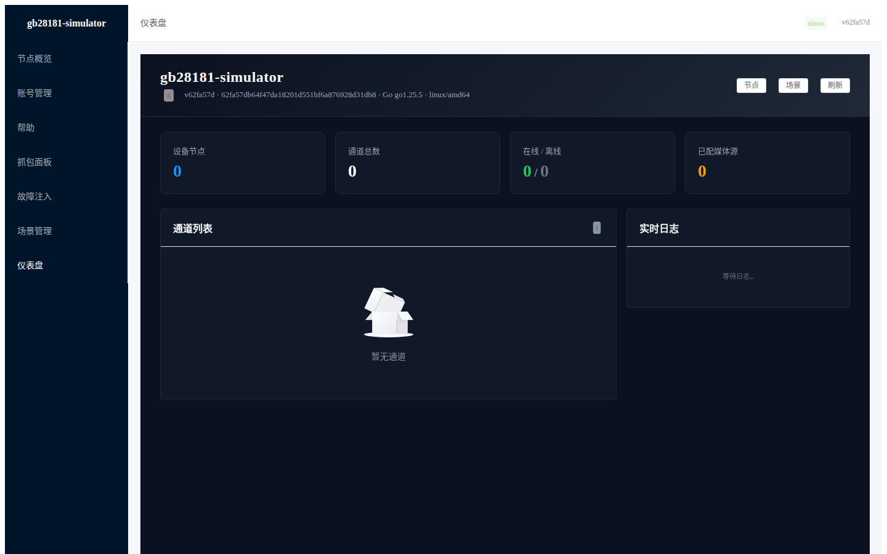

</div>

---

## 1. 打开界面

### Docker 部署

```
平台系统 Web UI：http://<宿主机IP>:18080
设备系统 Web UI：http://<宿主机IP>:18081
```

- 当前 Docker 部署使用端口偏移：Platform `18080`，Device `18081`（原默认 `8080` 端口被宿主机服务占用）。
- 根路径 `/` 自动重定向到 `/nodes`（含自动跳转至 Dashboard）。
- 无需认证，打开即用。

### 直接运行（本地）

```bash
cd /Users/noroadzh/code/jfys/go/gb28181-simulator
go run ./cmd/gb28181-simulator -config configs/config.example.yaml
# 访问 http://127.0.0.1:8080
```

### 前端构建

```bash
cd web
npm ci && npm run build
# 产物在 internal/interface/webui/embed/dist/，Go 编译时自动嵌入二进制
```

---

## 2. 侧边栏导航

导航菜单固定在页面左侧（深色背景，宽度 200px），从上到下：

| 菜单项 | 路径 | 对应 Vue 组件 |
|--------|------|---------------|
| Dashboard | `/`（重定向至 `/dashboard`） | `DashboardView.vue` |
| 节点概览 | `/nodes` | `NodesView.vue` |
| 场景管理 | `/scenarios` | `ScenarioView.vue` |

页面切换无需刷新，Vue Router 前端路由控制。顶部 Header 显示当前面包屑、服务状态（绿/红标签）和版本号。

<div style="max-width:900px">

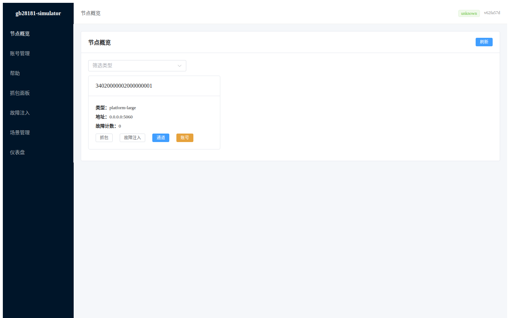

</div>

---

## 3. 节点概览

### 3.1 平台系统 {#31-平台系统-nodes}

**适用节点类型**：platform-large / platform-small

**代码位置**：`web/src/views/NodesView.vue`

**功能说明**：平台系统节点概览展示所有平台节点卡片，每个卡片显示节点 ID、状态标签（`online` 绿色 / `fault` 红色 / 其他灰色）、节点类型、监听地址、故障计数。平台节点无通道和媒体源概念，因此不显示相关按钮。

<div style="max-width:900px">


</div>

#### 功能

1. **刷新**：右上角「刷新」按钮，调用 `GET /v1/nodes` 重新拉取节点列表。
2. **筛选**：顶部分类筛选下拉框，可选：全部 / `device` / `platform-small` / `platform-large`。
3. **节点卡片**：

| 字段 | 说明 |
|------|------|
| 节点 ID | 节点标识（20 位国标 ID） |
| 状态标签 | `online`（绿色）/ 其他（灰色）/ `fault`（红色） |
| 类型 | `platform-large` / `platform-small` |
| 地址 | 节点监听地址 |
| 故障计数 | 累计触发的 fault 总数 |

4. **快捷操作按钮**：平台系统卡片提供「抓包」和「故障注入」两个快捷按钮。

#### 操作示例

1. 在浏览器打开 `http://<宿主机IP>:18080/nodes`
2. 确认筛选下拉框选中「全部」或具体平台类型
3. 点击某个平台节点卡片的「抓包」按钮，进入抓包面板
4. 点击「故障注入」按钮，进入故障注入页面

#### 注意事项

- 平台节点列表为空时显示「暂无节点」空状态（见第 11 节）。
- 节点状态为 `online` 需要节点已成功启动并完成注册。

---

### 3.2 设备系统 {#32-设备系统-nodesidchannels}

**适用节点类型**：device

**代码位置**：`web/src/views/NodesView.vue`

**功能说明**：设备系统节点概览与平台系统共用同一页面，但 device 节点卡片会额外显示「通道」和「媒体源」快捷按钮。这是同一个 Vue 组件，数据层的差异决定了按钮的显示与否。

<div style="max-width:900px">

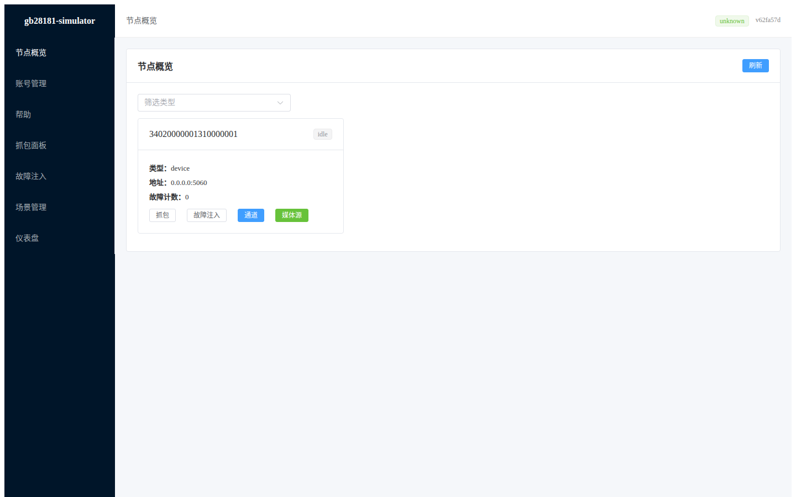

</div>

#### 功能

1. **刷新**、**筛选**：与平台系统相同。
2. **节点卡片**：device 类型额外显示：
   - **「通道」按钮** → 跳转 `/nodes/:id/channels` 查看通道列表
   - **「媒体源」按钮** → 弹出框快速配置节点级媒体源
3. **快捷操作按钮**：

| 按钮 | 适用节点 | 说明 |
|------|----------|------|
| 抓包 | 所有类型 | 跳转抓包面板 |
| 故障注入 | 所有类型 | 跳转故障注入页面 |
| 通道 | device | 查看通道列表 |
| 媒体源 | device | 配置节点级媒体源 |

#### 操作示例

1. 在浏览器打开 `http://<宿主机IP>:18081/nodes`
2. 在筛选下拉框选择 `device`，只显示设备节点
3. 点击某个设备节点卡片的「通道」按钮，进入通道列表
4. 点击「媒体源」按钮，在弹窗中配置媒体源类型和 URL

#### 注意事项

- 节点列表为空时显示「暂无节点」空状态（见第 11 节）。
- 节点状态为 `online` 需要节点已成功启动并完成注册。

---

## 4. 通道列表

**适用节点类型**：device（平台系统无此功能）

**代码位置**：`web/src/views/ChannelListView.vue`

device 节点可展开查看所有通道。该页面从 `GET /v1/nodes/:id/channels` 拉取通道列表，每张卡片显示通道 ID、名称、在线状态、是否已配媒体源。

<div style="max-width:900px">

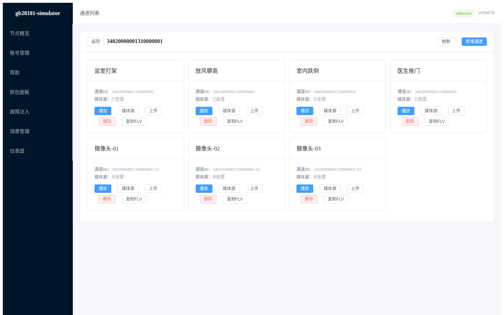

</div>

### 操作

1. 在 `/nodes` 节点概览页面点击 device 节点卡片上的「通道」按钮，或直接访问 `/nodes/<device-id>/channels`。
2. 列表加载完成后显示所有通道卡片，支持：
   - **播放**：跳转至通道详情 `/nodes/:id/channels/:ch`，进入 flv.js 实时播放。
   - **复制FLV**：将拉流地址 `http://<host>/v1/flv/<id>/<ch>` 写入剪贴板，可分享给其他客户端。
   - **设置媒体源**：弹窗输入媒体源类型与 URL（合成图 / 本地文件 / RTSP / HLS），对应 `PUT /v1/nodes/:id/channels/:ch/media`。

### 媒体源配置弹窗

> 📷 弹窗为触发式 UI（点击「设置媒体源」按钮后弹出），静态截图仅能展示通道列表页背景。`15-channel-media-source-dialog.png` 当前展示的是入口页面。

### 注意事项

- 通道未配置媒体源时点击播放会看到「无媒体源」提示或黑屏，需先配置。
- 通道级媒体源优先于节点级，回退逻辑参见 `internal/app/node_service.go` 的 `MediaConfig`。

---

## 5. 通道详情与实时播放

**适用节点类型**：device（平台系统无此功能）

**代码位置**：`web/src/views/ChannelDetailView.vue`

该页面是 Web 端的「实时监控」入口，集成了播放器、PTZ 控制面板、对讲按钮、快照抓图与拉流地址分享。

### 5.1 实时播放


- 使用 `flv.js`（BSD 协议）通过 HTTP-FLV 拉取后端流媒体网关 `/v1/flv/:id/:ch`，自动处理浏览器 MSE 兼容。
- 播放器下方显示当前连接状态。

### 5.2 PTZ 云台控制

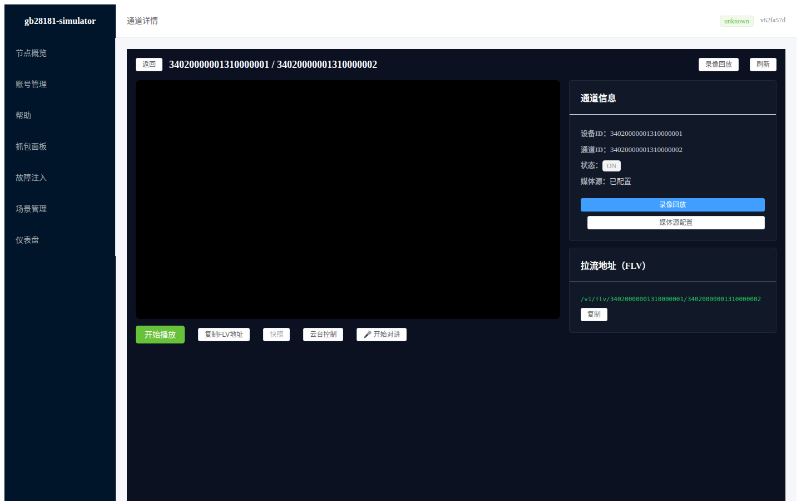

- **方向按钮**：八方向（上/下/左/右/左上/右上/左下/右下），按住持续发送指令（每 500ms 轮询一次），松开停止。
- **辅助功能**：变倍（zoom in/out）、变焦（focus near/far）、光圈（iris open/close）。
- **速度滑块**：控制转动速度（1–10），默认 5。
- **预置位**：输入预置位号（1–255），点击「预设」保存当前位置，「调用」触发定位。
- **抓图**：点击「抓图」按钮调用 `GET /v1/nodes/:id/channels/:ch/snapshot`，返回 JPEG 并自动下载。
- 后端对应 `POST /v1/nodes/:id/channels/:ch/ptz`，基于 MANSCDP DeviceControl 指令。

### 5.3 语音对讲


- 点击「开始对讲」：浏览器请求麦克风权限，采集 PCM 通过 WebSocket 上行到 `/v1/talk/ws/:session_id`。
- 后端基于 SIP INVITE 建立音频 RTP 会话（PCMU 编码），下行音频通过 WebSocket 推回浏览器播放。
- 点击「停止对讲」：关闭 WebSocket，发送 SIP BYE 结束会话。
- 后端对应 `POST /v1/nodes/:id/channels/:ch/talk/start` 与 `.../talk/stop`。

### 5.4 录像列表抽屉

- 点击「录像」按钮展开抽屉：从 `GET /v1/nodes/:id/channels/:ch/records` 查询录像列表。
- 每条录像显示开始/结束时间；点击「回放」跳转到录像回放页面。

### 5.5 拉流地址复制

- 页面右上角「复制 FLV 地址」按钮：将 `http://<host>/v1/flv/<id>/<ch>` 写入剪贴板，方便分享给 VLC、ffmpeg 等外部播放器。

---

## 6. 录像回放

**适用节点类型**：device（平台系统无此功能）

**代码位置**：`web/src/views/RecordView.vue`

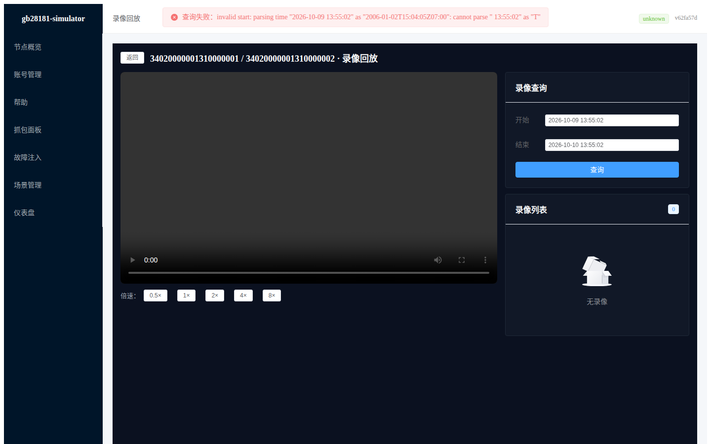

### 功能

1. **录像列表**：页面加载时从 `GET /v1/nodes/:id/channels/:ch/records?start=&end=` 查询时间段内的录像。
2. **时间筛选**：可输入起止时间（ISO 8601 格式）精确查询某一时间窗。
3. **回放播放器**：选中录像后，使用 `flv.js` 通过 HTTP-FLV 拉取回放流（与实时播放共用网关）。
4. **倍速控制**：支持 0.5× / 1× / 1.5× / 2× / 4× / 8× 倍速切换。
5. **暂停 / 继续**：暂停按钮暂停当前回放流。
6. **进度条拖动**：可拖动至任意时间点（基于 flv.js 的 seek 能力）。

### 操作示例

1. 在通道详情页面点击「录像」打开抽屉，或直接访问 `/nodes/<id>/channels/<ch>/record`。
2. 选择起止时间后点击「查询」，下方列出录像列表。
3. 点击某条录像切换到播放器，按需调节倍速或暂停。

---

## 7. 抓包面板

### 7.1 平台系统 {#71-平台系统-capture}

**适用节点类型**：platform-large / platform-small

**代码位置**：`web/src/views/CaptureView.vue`

<div style="max-width:900px">

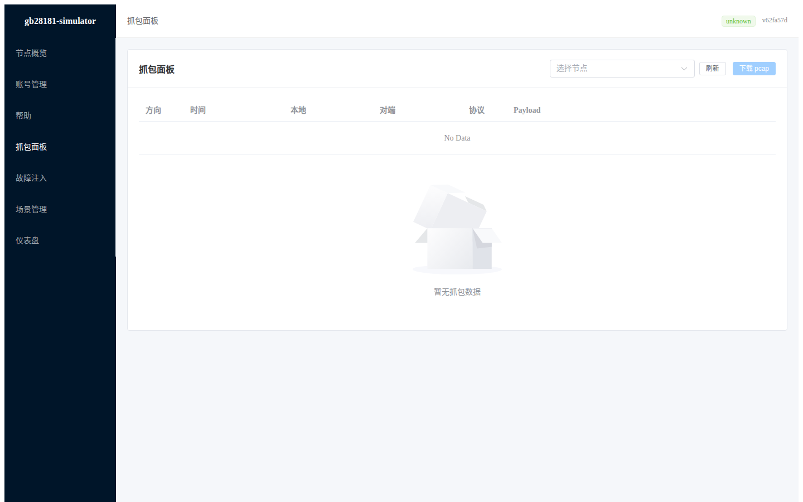

</div>

### 功能

1. **选择节点**：顶部下拉框从当前节点列表选择要查看的平台节点。
2. **自动刷新**：每 3 秒自动拉取最新抓包数据（`GET /v1/nodes/:id/capture?limit=50`）。
3. **手动刷新**：「刷新」按钮立即重新拉取。
4. **下载 pcap**：「下载 pcap」按钮在新标签页打开 `GET /v1/nodes/:id/capture.pcap`，浏览器下载 `.pcap` 文件。
5. **查看 Payload**：点击表格中 Payload 列的字节数，弹出 Popover 显示十六进制 hexdump。

### 表格列

| 列名 | 说明 |
|------|------|
| 方向 | `t`（发送，橙色）/ `r`（接收，绿色） |
| 时间 | 抓包事件时间戳（本地时间格式） |
| 本地 | 本地地址 `IP:端口` |
| 对端 | 远端地址 `IP:端口` |
| 协议 | 传输协议（UDP / TCP 等） |
| Payload | 点击查看 hexdump |

### Payload Hexdump 弹窗

> 📷 Payload hexdump 为点击触发的浮层（Popover），静态截图无法呈现。点击「Payload」列字节数即可查看。

---

### 7.2 设备系统 {#72-设备系统-capture}

**适用节点类型**：device

**代码位置**：`web/src/views/CaptureView.vue`

<div style="max-width:900px">

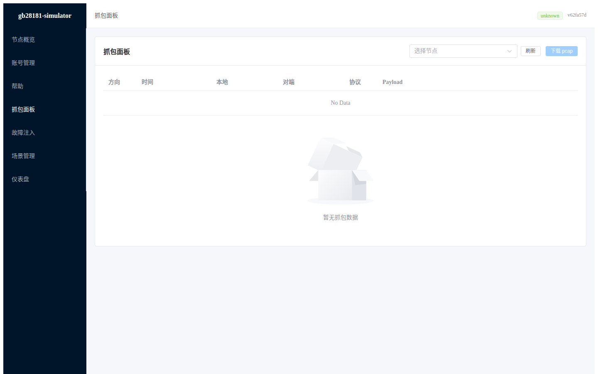

</div>

### 功能

与平台系统完全相同，功能说明参见 7.1 节。差异在于可选节点类型为 device，可观察设备节点的 SIP 注册、Catalog 查询、媒体控制等信令。

### 操作示例（通用）

1. 进入 `/capture`，在「选择节点」下拉框选中目标节点（平台或设备）。
2. 等待 3 秒自动刷新，或点击「刷新」立即拉取。
3. 若该节点有 SIP 消息，表格会显示抓包事件列表。
4. 点击某个事件的 Payload 列中的字节数，查看十六进制内容。
5. 点击「下载 pcap」保存完整抓包文件到本地，可用 Wireshark 打开分析。

### 常见问题

**报错 "app: capture store not configured"**：在 `config.yaml` 中添加：

```yaml
capture:
  enabled: true
  capacity: 2048
```

重启服务后生效。容量为每个节点环形缓冲区大小（默认 2048 条事件）。

---

## 8. 故障注入

### 8.1 平台系统 {#81-平台系统-fault}

**适用节点类型**：platform-large / platform-small

**代码位置**：`web/src/views/FaultView.vue`

<div style="max-width:900px">


</div>

### 功能

1. **安装故障 Profile**：左侧表单，配置故障注入规则后点击「安装」。
2. **查看当前 Profile**：右侧展示当前已安装的 fault profile 和异常计数。
3. **清除故障**：「清除故障」按钮删除当前 profile。

### 支持的故障类型

| 字段 | 说明 | 值范围 |
|------|------|--------|
| Canned（方法:状态码） | 特定 SIP 方法强制返回指定状态码 | 格式：`METHOD:code, METHOD:code`，code 范围 400–699 |
| Delay Base (ms) | 所有请求的基础延迟 | ≥ 0 |
| Delay Jitter (ms) | 延迟的随机波动范围 | ≥ 0 |
| Drop 概率 | 随机丢弃请求的概率 | 0.0 – 1.0 |
| Blackhole 方法 | 指定方法完全不响应（静默丢弃） | 逗号分隔的方法名，如 `MESSAGE,SUBSCRIBE` |
| UnsupportedMethod | 强制返回 501 的方法 | 0 – 699（状态码范围） |

---

### 8.2 设备系统 {#82-设备系统-fault}

**适用节点类型**：device

**代码位置**：`web/src/views/FaultView.vue`

<div style="max-width:900px">

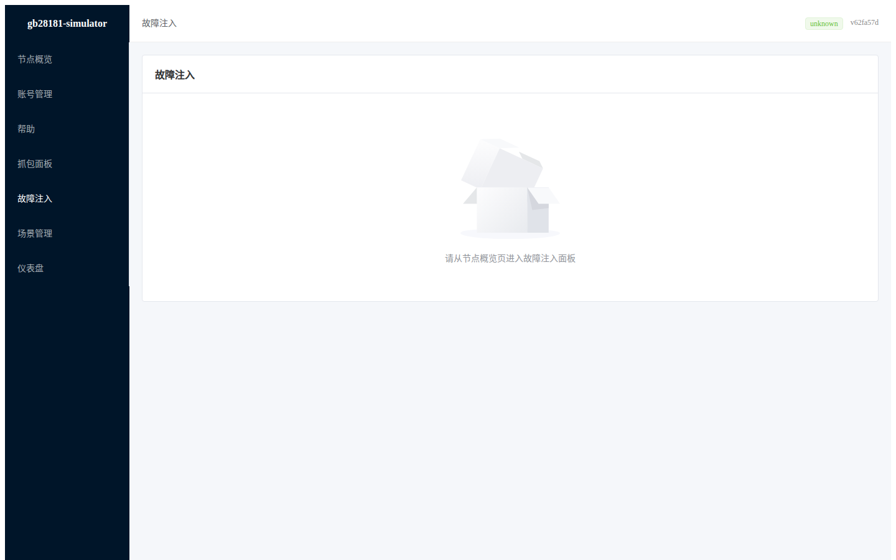

</div>

### 功能

与平台系统完全相同，功能说明参见 8.1 节。差异在于可选节点类型为 device，常用于模拟设备端故障场景（如设备注册失败、Catalog 响应延迟等）。

### 操作示例（通用）

1. 进入 `/fault/:id`（从节点概览页点击「故障注入」或手动输入 URL）。
2. 在左侧表单填写：
   - Canned：`REGISTER:403, INVITE:486`（注册返回 403，点播返回 486）
   - Delay Base：`200`（所有请求延迟 200ms）
   - Drop：`0.1`（10% 概率丢弃）
3. 点击「安装」，显示「故障 profile 已安装」提示。
4. 右侧「当前 Profile」展示已安装的配置，以及各异常类型的触发计数。
5. 测试完成后点击「清除故障」恢复正常行为。

### 注意事项

- 未安装 profile 时右侧显示「未安装故障 Profile」空状态（见第 11 节）。
- 清除故障后所有计数器归零。
- `no fault profile installed` 错误会被静默处理（不弹提示）。

---

## 9. 场景管理

### 9.1 平台系统 {#91-平台系统-scenarios}

**适用节点类型**：platform-large / platform-small

**代码位置**：`web/src/views/ScenarioView.vue`

<div style="max-width:900px">

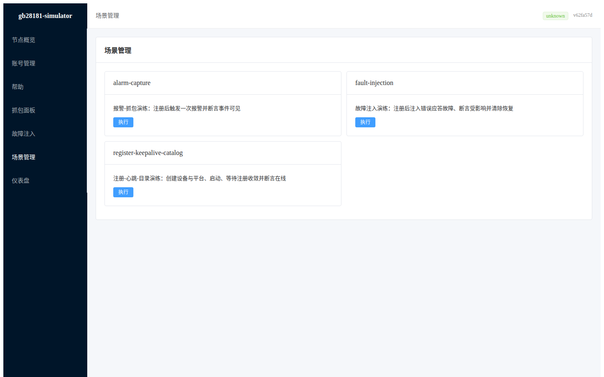

</div>

### 功能

1. **场景列表**：展示所有可用的测试场景卡片。
2. **执行场景**：点击「执行」按钮运行场景（同一时刻只能运行一个场景）。
3. **执行报告**：运行完成后显示详细报告，包含每个步骤的状态和耗时。

> 📷 执行报告在点击「执行」并运行完成后才显示，当前部署未运行场景，`09-platform-scenario-report.png` 展示的是场景列表默认状态（与 07 相同页面）。

### 场景卡片字段

| 字段 | 说明 |
|------|------|
| Name | 场景唯一标识 |
| Description | 场景描述（YAML 文件中的描述字段） |
| 执行中标签 | 当前场景正在运行时显示黄色「执行中」标签 |

### 执行报告

| 字段 | 说明 |
|------|------|
| scenario_name | 执行的场景名称 |
| total | `passed`（绿色）/ `failed`（红色） |
| 耗时 | 场景总执行时间（毫秒） |
| steps | 步骤列表，每步包含：步骤类型、状态、耗时、错误信息 |

---

### 9.2 设备系统 {#92-设备系统-scenarios}

**适用节点类型**：device

**代码位置**：`web/src/views/ScenarioView.vue`

<div style="max-width:900px">


</div>

### 功能

与平台系统共用同一页面和组件。差异在于场景 YAML 中引用的节点类型为 device，可执行设备相关的测试场景（如设备注册、通道查询、PTZ 控制、录像回放等端到端流程）。

### 操作示例（通用）

1. 进入 `/scenarios`。
2. 找到要执行的场景卡片，点击「执行」按钮。
3. 按钮变为 loading 状态，同时显示「执行中」标签。
4. 场景执行完成后，页面下方出现执行报告。
5. 若所有步骤均 passed，显示绿色 `passed` 标签；否则显示红色 `failed` 并查看失败步骤的错误信息。

### 注意事项

- 同一时刻只能运行一个场景，其他「执行」按钮会被禁用。
- 尚无执行报告时，页面不显示报告区域。
- 后端 `scenario engine` 未装配时 `POST /v1/scenarios/run` 返回 501。

---

## 10. 仪表盘

**适用节点类型**：所有（平台系统与设备系统共用）

**代码位置**：`web/src/views/DashboardView.vue`

<div style="max-width:900px">

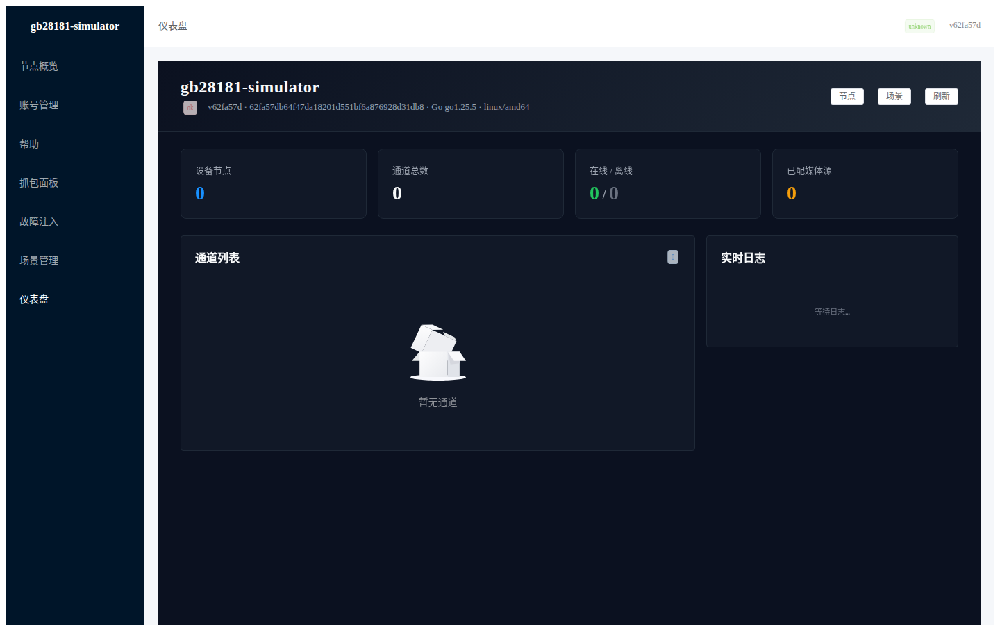

</div>

### 功能

1. **统计卡片**：顶部四张卡片显示设备节点数、通道总数、在线/离线数、已配媒体源数。
2. **通道列表**：device 节点的通道卡片，可点击进入播放详情，或复制 FLV 拉流地址。
3. **实时日志流**：通过 WebSocket 实时推送日志到前端表格，最多保留 200 条，新日志从顶部插入。
4. **健康状态**：顶部 Header 绿色/红色标签反映服务健康状态。

### 操作示例

1. 进入 `/dashboard`（首页自动跳转）。
2. 查看统计卡片了解当前系统运行状态。
3. 点击通道卡片进入实时播放，或点击「复制FLV」分享拉流地址。
4. 观察日志表格的实时滚动，调试时重点关注 `internal/app` 和 `internal/adapter/media` 模块的日志。

---

## 11. 空状态页面

当后端无数据或功能未配置时，页面显示 Element Plus `el-empty` 空状态组件。

<div style="max-width:900px">


</div>

| 场景 | 触发条件 | 提示文案 |
|------|----------|----------|
| 节点概览无节点 | `GET /v1/nodes` 返回空列表 | 「暂无节点」 |
| 通道列表为空 | device 节点无通道数据 | 「暂无通道」 |
| 未安装故障 Profile | 故障注入页面无 profile | 「未安装故障 Profile」 |
| 场景列表为空 | `/scenarios` 目录无 YAML | 「暂无场景」 |
| 仪表盘无数据 | 节点和通道均未初始化 | 显示统计卡片为 0 |

---

## 12. 常见问题排查

### 12.1 页面打不开 / 404

| 现象 | 排查 |
|------|------|
| 连接被拒绝 | 检查容器/进程是否在运行，端口是否正确 |
| 404 页面 | 确认 URL 路径正确 |

### 12.2 节点列表为空

- 确认 `config.yaml` 的 `nodes:` 段配置了节点，且节点 ID 格式正确（20 位国标 ID）。
- 确认服务已启动且 HTTP 端口可访问。
- 查看 `/dashboard` 的日志流，查找配置加载错误。

### 12.3 通道列表为空（设备系统专属）

- 确认该节点类型为 `device`（platform 节点无通道）。
- 确认节点已启动并注册成功（状态为 `online`）。
- 查看日志中是否有 Catalog 响应错误。

### 12.4 播放无画面（黑屏）（设备系统专属）

- 确认通道已配置媒体源（通道卡片显示「✓ 已配置」）。
- 确认 flv.js 是否正常加载（浏览器控制台无报错）。
- 检查 `/v1/flv/:id/:ch` 在新标签页直接访问是否返回 FLV 流。

### 12.5 PTZ 不生效（设备系统专属）

- 确认设备支持云台控制（模拟器中合成图媒体源支持 PTZ 指令）。
- 检查日志中 `DeviceControl` 是否被正确解析。
- 确认 `handleDeviceControl` 中对应的 command_type 是 `DeviceControl`（而非 `TeleBoot` 等）。

### 12.6 抓包面板报错 "capture store not configured"

在 `config.yaml` 中添加：

```yaml
capture:
  enabled: true
  capacity: 2048
```

重启服务。注意 Docker 部署时若只修改了 bind mount 的 config 文件，需要 `docker compose restart` 而非 `up -d`。

### 12.7 故障注入不生效

- 确认节点已启动并在线（状态为 `online`）。
- 确认安装时表单填写正确（Canned 状态码 400–699，Delay 非负，Drop 在 0–1 之间）。
- 查看 `/dashboard` 日志流，确认 acceptor 是否读到 fault profile。

### 12.8 场景执行 501

- 确认 `scenario engine` 已装配：`cmd/gb28181-simulator/main.go` 中 `scenarioRunner` 非 nil。
- 如果未装配，`POST /v1/scenarios/run` 返回 `{"error":"scenario engine not configured"}`。

### 12.9 节点状态始终不是 online

- device 节点需要正确配置 `registration.server` 指向 platform 地址。
- Docker 部署中 device 的 `registration.server` 应使用 Compose 服务名：`gbsim-platform:5060`。
- 查看日志中是否有 401 挑战或注册超时错误。
